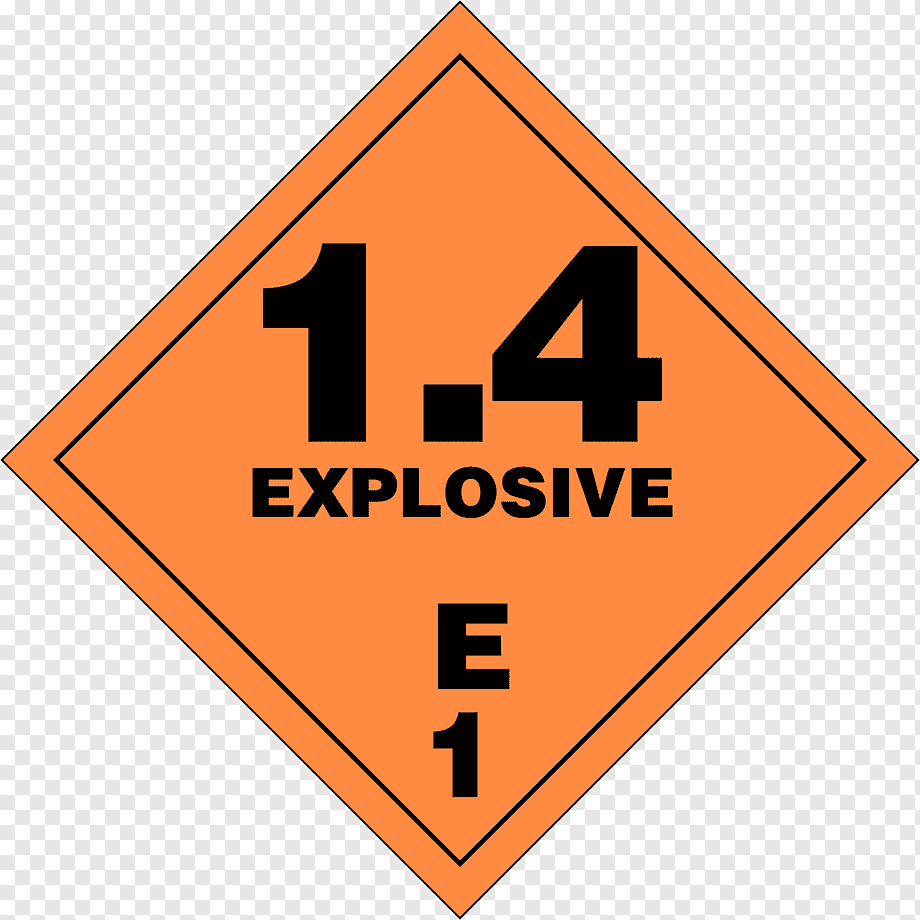
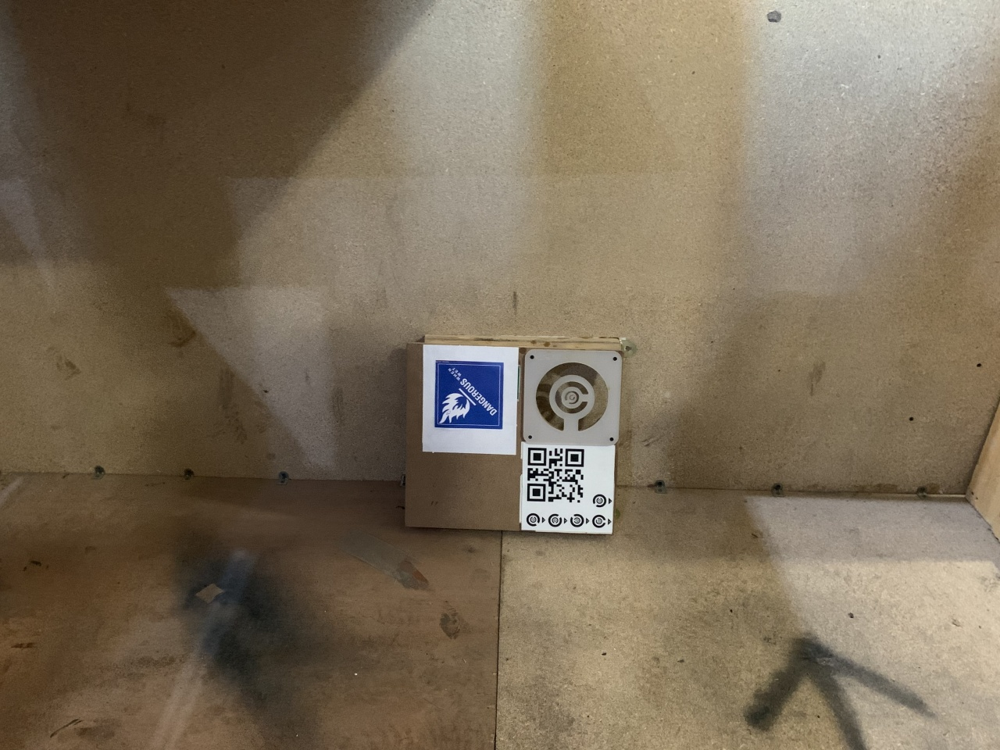
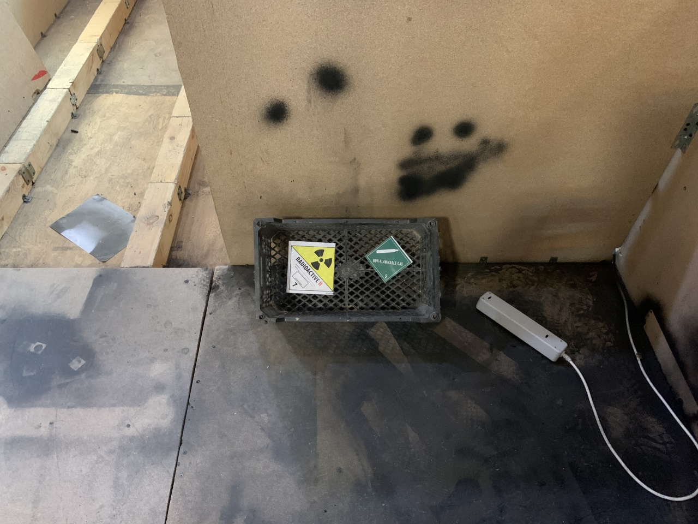

### HAZMAT-13: Hazaradous Materials Signs Dataset

---
#### Abstract

We have developed a comprehensive dataset of HAZMAT sign, including images from various viewing angels, distortions, and different illumination conditions. The dataset has been divided into 13 different classes as shown below. The dataset is annotated with PASCAL-VOC format as it is easy to convert into other annotation formats such as YOLO or COCO.

| Name | Image | Name | Image |
|---|---|---|---|
| 1- Poison |  | 2- Oxygen | |
| 3- Flammable Gas |  | 4- Flammable Solid | | 
| 5- Corrosive | | 6- Dangerous |  | 
| 7- Non-flammable Gas | | 8- Organic Peroxide |  |
| 9- Explosive |  |  10- Radioactive |  |
| 11- Inhalation Hazard |  | 12- Spontaneously Combustible |   | 
| 13- Infectious Substance |    |  |  |


The dataset consist of three different models that mentioned below: 

---
#### 1. Original model: 

Consist of 1685 images with no augment and consist of bounding box and segmented mask

 

1. Row a, b: Samples in different angles, lighting conditions, and backgrounds. 
2. Row c, d: Samples in different situation at RoboCup competitions in past years.

[Download Link](https://drive.google.com/drive/folders/1-dQPRdQ-MRp6mrPhnpng5pcgJsTZMg23?usp=sharing)

---
#### 2. Augmented model: 

Applying data augmentation we increased the number of HAZMAT signs to improve the performance of our algorithm. Besides, the dataset needs to be balanced and the number of images for each class should be almost same to have a Homogeneous dataset. Also, the size of our dataset should neither be very small that lead to model under-fitting and detection accuracy loss, and nor too large to increase the complexity of the feature extraction and overfitting challenges. To aim this, and using the augmentation technique, we expanded the dataset to 4065 images per class and in overall 52845 images. We split the dataset into 80% train set and 20% test set.

[Download Link](https://drive.google.com/drive/folders/1ZglTZkiIhb6xI0v9cwXJfV2-Y4yL9S1V?usp=sharing)

---

#### 3. Different distance
We prepare small dataset in 3 different distance to measure our method performance. It consist in 3 different distances 50cm, 100cm and 150cm.

|| 50cm | 100cm | 150cm |
|---|---|---|---|
|1 | ||  |
|2 | ||  |
|3 | ||  |
|4 | ||  |
|5 | ||  |

[Download Link](https://drive.google.com/drive/folders/1aBcR-5jOs3gRce4oHBA1bQ3crp8F9UD-?usp=sharing)

---
#### Citation 
If this dataset help you during  research feel free to cite it:
```
@article{SHARIFI2021100104,
title = {A deep learning based hazardous materials (HAZMAT) sign detection robot with restricted computational resources},
journal = {Machine Learning with Applications},
pages = {100104},
year = {2021},
issn = {2666-8270},
doi = {https://doi.org/10.1016/j.mlwa.2021.100104},
url = {https://www.sciencedirect.com/science/article/pii/S2666827021000529},
author = {Amir Sharifi and Ahmadreza Zibaei and Mahdi Rezaei},
keywords = {Hazardous materials, Object recognition, HAZMAT sign detection, Segmentation, CNN, Rescue robotics},
abstract = {One of the most challenging and non-trivial tasks in robot-based rescue operations is the Hazardous Materials (HAZMAT) sign detection in dangerous operation fields, in order to prevent further unexpected disasters. Each HAZMAT sign has a specific meaning that the rescue robot should detect and interpret it to take a safe action, accordingly. Accurate HAZMAT detection and real-time processing are the two most important factors in such robotics applications. Furthermore, the rescue robot should cope with some secondary challenges such as image distortion and restricted CPU and computational resources, embedded in the robot. In this research, we propose a CNN-Based pipeline called DeepHAZMAT for HAZMAT sign detection and segmentation in four steps: (1) Input data volume optimisation before feeding into the CNN network, (2) Application of a YOLO-based structure to collect the required visual information from the hazardous areas, (3) HAZMAT sign segmentation and separation from the background using adaptive GrabCut technique, and (4) Post-processing optimisation using morphological operators and convex hull algorithms. In spite of the utilisation of a very limited CPU and memory resources, the experimental results show the proposed method has successfully maintained a better performance in terms of detection-speed and detection-accuracy, compared to classical and modern state-of-the-art methods.}
}
```
